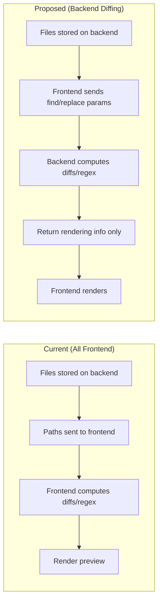

# Backend Diffing Refactor

Move diffing/regex-matching computation from frontend to backend for a batch file renamer tool.

## Current vs Proposed Architecture



---

## Two Modes of Operation

| Mode | Condition | Backend Returns | Frontend Renders |
|------|-----------|-----------------|------------------|
| **Standard Diff** | No regex OR regex without groups | `DiffSegment[]` (added/removed/unchanged) | Colored diff highlighting |
| **Regex Groups** | Regex with capture groups `(...)` | `GroupMatch[]` (group index + text) | Each group in different color |

---

## Proposed Changes

### Backend (Rust)

#### [MODIFY] [Cargo.toml](file:///home/hayk/side-projects/simple-tools/src-tauri/Cargo.toml)

```toml
[dependencies]
dissimilar = "1.0"  # Character-level diff with semantic cleanup
regex = "1"         # Regex matching with capture groups
```

---

#### [NEW] [diff.rs](file:///home/hayk/side-projects/simple-tools/src-tauri/src/diff.rs)

```rust
use dissimilar::Chunk;
use regex::Regex;
use serde::{Deserialize, Serialize};

// ==================== Standard Diff Types ====================

#[derive(Serialize, Deserialize, Clone)]
#[serde(rename_all = "camelCase")]
pub enum DiffSegmentType { Added, Removed, Unchanged }

#[derive(Serialize, Deserialize, Clone)]
#[serde(rename_all = "camelCase")]
pub struct DiffSegment {
    pub segment_type: DiffSegmentType,
    pub text: String,
}

/// Standard diff mode - uses dissimilar for character-level diff
pub fn compute_diff(original: &str, modified: &str) -> Vec<DiffSegment> {
    dissimilar::diff(original, modified)
        .into_iter()
        .map(|chunk| match chunk {
            Chunk::Equal(s) => DiffSegment {
                segment_type: DiffSegmentType::Unchanged,
                text: s.to_string(),
            },
            Chunk::Delete(s) => DiffSegment {
                segment_type: DiffSegmentType::Removed,
                text: s.to_string(),
            },
            Chunk::Insert(s) => DiffSegment {
                segment_type: DiffSegmentType::Added,
                text: s.to_string(),
            },
        })
        .collect()
}

// ==================== Regex Highlight Types ====================

/// Segment of text for regex highlighting - includes FULL string with gaps
#[derive(Serialize, Deserialize, Clone)]
#[serde(rename_all = "camelCase", tag = "type", content = "value")]
pub enum RegexSegment {
    /// Standard text (not part of a match)
    Text(String),
    /// Highlighted group text (id: 0=whole match, 1..N=capture groups)
    Group { id: usize, text: String },
}

/// Returns full segmented string with regex matches highlighted.
/// Includes non-matching text as `Text` segments for complete rendering.
pub fn get_regex_highlights(text: &str, pattern: &str) -> Result<Vec<RegexSegment>, String> {
    let re = Regex::new(pattern).map_err(|e| e.to_string())?;
    let mut segments = Vec::new();
    let mut last_idx = 0;

    for cap in re.captures_iter(text) {
        let whole_match = cap.get(0).unwrap();
        
        // 1. Push text BEFORE the match
        if whole_match.start() > last_idx {
            segments.push(RegexSegment::Text(text[last_idx..whole_match.start()].to_string()));
        }

        // 2. Handle capture groups or whole match
        if cap.len() > 1 {
        // Has explicit capture groups - highlight each
            let mut inner_last = whole_match.start();
            for i in 1..cap.len() {
                if let Some(g) = cap.get(i) {
                    // SAFETY CHECK: Prevent nested/overlapping groups from duplicating text
                    if g.start() < inner_last {
                        continue; 
                    }

                    // Text between capture groups
                    if g.start() > inner_last {
                        segments.push(RegexSegment::Text(text[inner_last..g.start()].to_string()));
                    }
                    
                    segments.push(RegexSegment::Group { id: i, text: g.as_str().to_string() });
                    inner_last = g.end();
                }
            }
            // Remaining text inside the whole match
            if inner_last < whole_match.end() {
                segments.push(RegexSegment::Text(text[inner_last..whole_match.end()].to_string()));
            }
        } else {
            // No capture groups - highlight entire match as group 0
            segments.push(RegexSegment::Group { id: 0, text: whole_match.as_str().to_string() });
        }

        last_idx = whole_match.end();
    }

    // 3. Push remaining text AFTER the last match
    if last_idx < text.len() {
        segments.push(RegexSegment::Text(text[last_idx..].to_string()));
    }

    Ok(segments)
}

/// Robust check for capture groups using the regex engine itself
pub fn has_capture_groups(pattern: &str) -> bool {
    match Regex::new(pattern) {
        Ok(re) => re.captures_len() > 1, // >1 because group 0 is always the whole match
        Err(_) => false,
    }
}

---

#### [NEW] [file_state.rs](file:///home/hayk/side-projects/simple-tools/src-tauri/src/file_state.rs)

Session-based file storage (files stay on backend after selection):

```rust
use std::sync::RwLock;

pub struct FileState {
    files: RwLock<Vec<String>>,  // Single session for single-user app
}

impl FileState {
    pub fn new() -> Self { Self { files: RwLock::new(Vec::new()) } }
    pub fn set_files(&self, files: Vec<String>) { *self.files.write().unwrap() = files; }
    pub fn get_files(&self) -> Vec<String> { self.files.read().unwrap().clone() }
    pub fn clear(&self) { self.files.write().unwrap().clear(); }
}
```

---

#### [MODIFY] [rename.rs](file:///home/hayk/side-projects/simple-tools/src-tauri/src/rename.rs)

New command that returns either diffs OR regex-highlighted segments:

```rust
#[derive(Serialize, Deserialize)]
#[serde(rename_all = "camelCase")]
pub struct DiffOptions {
    pub find: String,
    pub replace: String,
    pub case_sensitive: bool,
    pub regex_mode: bool,
    pub replace_first_only: bool,
    pub include_ext: bool,
}

#[derive(Serialize, Deserialize)]
#[serde(rename_all = "camelCase", tag = "type")]
pub enum FilePreviewResult {
    /// Standard diff mode - show added/removed/unchanged
    Diff {
        path: String,
        name: String,
        new_name: String,
        original_segments: Vec<DiffSegment>,  // For "Original" column
        modified_segments: Vec<DiffSegment>,  // For "New Name" column
        has_collision: bool,
    },
    /// Regex groups mode - original shows colored groups, new name shows standard diff
    RegexGroups {
        path: String,
        name: String,
        new_name: String,
        // FULL segmented string with Text/Group for rendering original with highlights
        original_segments: Vec<RegexSegment>,
        // Standard diff for new name (groups don't exist in output, they were consumed)
        modified_segments: Vec<DiffSegment>,
        has_collision: bool,
    },
}

#[tauri::command]
pub fn compute_previews(
    file_state: tauri::State<'_, FileState>,
    options: DiffOptions,
) -> Result<Vec<FilePreviewResult>, String> {
    let files = file_state.get_files();
    let use_groups = options.regex_mode && has_capture_groups(&options.find);
    
    // Compute preview for each file...
}
```

---

### Frontend (TypeScript/SolidJS)

#### [MODIFY] [types.ts](file:///home/hayk/side-projects/simple-tools/src/components/BatchRenamer/types.ts)

```typescript
// Segment types
export type DiffSegment = { segmentType: 'added' | 'removed' | 'unchanged'; text: string };
export type RegexSegment = 
  | { type: 'text'; value: string }
  | { type: 'group'; value: { id: number; text: string } };

// Matches backend enum
export type FilePreviewResult = 
  | { type: 'diff'; path: string; name: string; newName: string; 
      originalSegments: DiffSegment[]; modifiedSegments: DiffSegment[]; 
      hasCollision: boolean; }
  | { type: 'regexGroups'; path: string; name: string; newName: string;
      originalSegments: RegexSegment[];  // Full segmented string with gaps
      modifiedSegments: DiffSegment[];   // Standard diff for new name
      hasCollision: boolean; };
```

---

#### [MODIFY] [index.tsx](file:///home/hayk/side-projects/simple-tools/src/components/BatchRenamer/index.tsx)

- Remove `selectedPaths` signal (files stay on backend)
- Remove `fileItems` memo computation
- Add `invoke('compute_previews', { options })` call when find/replace changes
- Store `FilePreviewResult[]` in signal for rendering

---

#### [MODIFY] [FileRow.tsx](file:///home/hayk/side-projects/simple-tools/src/components/BatchRenamer/FileRow.tsx)

Render based on result type:
- `type: 'diff'` → render `DiffSegment[]` with added/removed styling
- `type: 'regexGroups'` → render each group in distinct color (e.g., group 1 = blue, group 2 = green, etc.)

---

---

## FileRemover Refactor

Refactor `FileRemover` to use the same "backend state" pattern as `BatchRenamer` and ensure highlight info is properly returned.

### Current Flow
1. Frontend calls `search_files_by_pattern`.
2. Backend returns full `Vec<FileMatchResult>`.
3. Frontend renders and highlights.

### Proposed Flow
1. Frontend calls `search_files_..` with session ID.
2. Backend searches, **stores results in `FileState`**, returns count.
3. Frontend calls `get_remover_results` (paginated or all).
4. Backend returns `FileMatchResult` including `match_ranges` for highlighting.

### Backend Changes

#### [MODIFY] [file_state.rs](file:///home/hayk/side-projects/simple-tools/src-tauri/src/file_state.rs)

Extend `FileState` to hold remover results too:
```rust
pub struct FileState {
    renamer_files: RwLock<Vec<String>>,
    remover_results: RwLock<Vec<FileMatchResult>>, // New field
}
```

#### [MODIFY] [remove.rs](file:///home/hayk/side-projects/simple-tools/src-tauri/src/remove.rs)

Update search commands to store in state:
```rust
#[tauri::command]
pub fn search_files_by_pattern(
    state: tauri::State<'_, FileState>,
    // ... params ...
) -> Result<usize, String> { // Return count only
    let results = // ... perform search ...
    state.set_remover_results(results);
    Ok(results.len())
}

#[tauri::command]
pub fn get_remover_results(
    state: tauri::State<'_, FileState>,
) -> Result<Vec<FileMatchResult>, String> {
    Ok(state.get_remover_results())
}
```

### Frontend Changes

#### [MODIFY] [FileRemover/index.tsx](file:///home/hayk/side-projects/simple-tools/src/components/FileRemover/index.tsx)
- Call search → receive count.
- Fetch results → receive `FileMatchResult[]`.
- `matchRanges` are already present in `FileMatchResult`, so ensure they are used for highlighting (they correspond to the found pattern).

---

```bash
# Backend tests
cd src-tauri && cargo test diff::tests

# Frontend tests  
bun run test --run

# Manual: Select folder, test both modes
# 1. Simple find/replace → verify diff highlighting
# 2. Regex with groups e.g. `(\d+)-(\w+)` → verify colored groups
```
